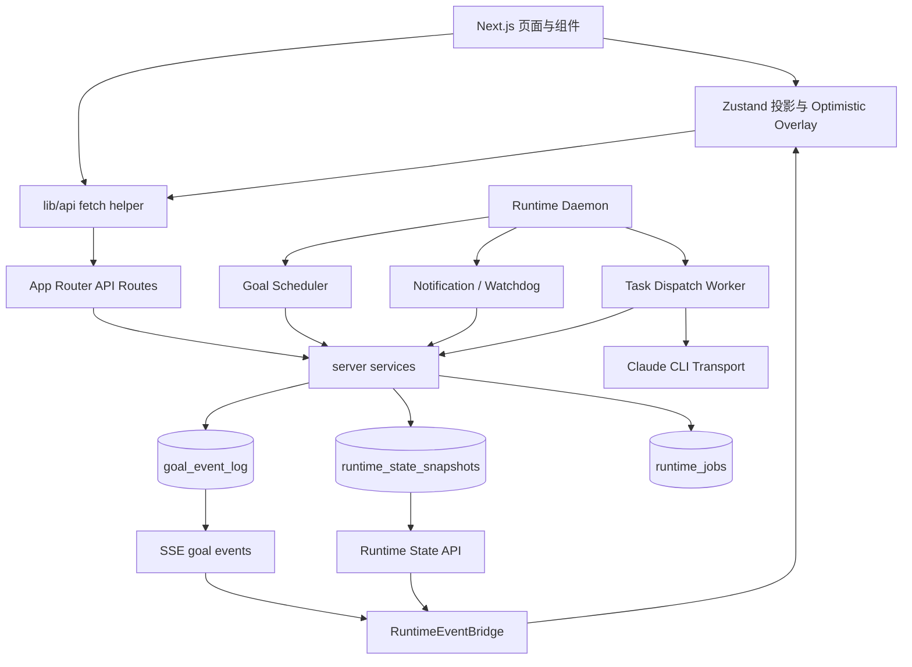
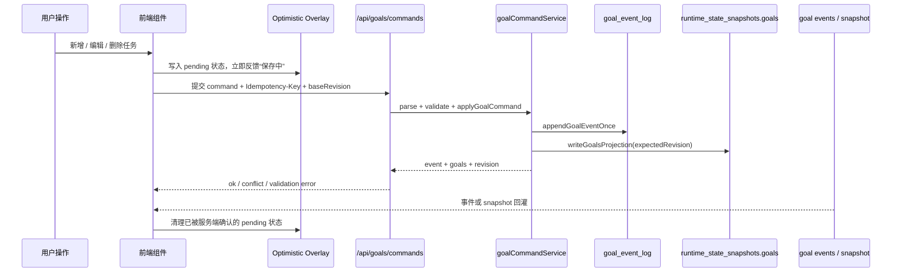

# KiKi 当前项目整体架构

> 更新时间：2026-05-20  
> 范围：当前仓库 `long_horizon_agent` 的产品定位、工程分层、运行时链路、数据权威源、关键约束与后续风险。

## 1. 一句话定位

KiKi 是一个面向长期目标管理与自主执行的本地 Agent 产品原型。它通过对话收集目标信息，生成可执行计划，由本地 daemon / worker 调度 Claude CLI 执行任务，并把进度、结果、通知与待用户确认事项回流到前端界面。

当前项目已经不再是早期 README 中描述的“纯前端原型”。现状更接近：

- 前端负责交互、投影展示、乐观图层与用户命令提交。
- Next.js API Route 负责命令接入、运行时查询、Claude 调用和产物服务。
- 服务端 `lib/server` 负责目标规划、任务执行、事件记录、状态快照和领域规则。
- 本地 daemon / worker 负责调度、通知、超时看护、任务派发和恢复。
- SQLite 负责事件日志、运行时队列、产物索引和 runtime snapshot。

## 2. 总体分层

```text
用户界面 / Next.js App Router
  ↓
组件与交互容器 / Zustand 投影 Store
  ↓
API Client / Command API / Runtime API
  ↓
Server Services / Domain / Repositories
  ↓
SQLite Snapshot + Event Log + Runtime Jobs
  ↓
Runtime Daemon / Scheduler / Dispatch Worker / Claude CLI
```



## 3. 核心目录

| 目录 | 职责 |
| --- | --- |
| `src/app/` | Next.js 页面路由与 API Route。页面包含收件箱、会话、目标、任务、日程；API 包含 goals、runtime、claude、artifacts、runtime-envs 等。 |
| `src/components/` | UI 与交互容器，按 `layout`、`conversation`、`goal`、`task`、`execution`、`inbox`、`schedule`、`settings` 分域。 |
| `src/stores/` | Zustand 前端状态。现阶段核心原则是 `goalStore` 只承接服务端投影与 optimistic overlay，不再作为 canonical goal 写入源。 |
| `src/lib/api/` | 浏览器侧 API helper，封装 command、runtime、event、Claude、artifact 等请求。 |
| `src/lib/server/` | 服务端核心业务层，包括目标规划、任务执行、Claude transport、domain policy、repositories、runtime snapshot、worker 和 services。 |
| `src/lib/daemon/` | 本地 runtime daemon 配置、状态和循环执行器。 |
| `src/bin/` | daemon CLI 入口，当前 `kiki-runtime-daemon.ts` 调用 `runRuntimeDaemonLoop`。 |
| `scripts/` | 架构约束和回归校验脚本，例如 `verify-architecture`、`verify-goal-command-service`、`verify-goal-event-cursor`。 |
| `docs/plans/` | 重大架构方案、迁移路线、剩余路线图与专项设计文档。 |
| `data/` | 本地 SQLite 与 workspace runtime 文件，属于运行态数据，不应提交。 |

## 4. 产品信息架构

主要页面与用户入口：

| 路由 / 容器 | 说明 |
| --- | --- |
| `/` | 收件箱首页，展示系统主动产生的提醒、执行结果与待处理事项。 |
| `/conversations` | 会话列表。 |
| `/conversations/[conversationId]` | 沉浸式会话页，承载普通聊天和 `/goal` 长程目标入口。 |
| `/goals/[goalId]` | 目标详情页，展示目标、子目标、任务、执行状态与规划工作流。 |
| `/goals/[goalId]/tasks/[taskId]` | 任务详情与执行页，查看任务说明、实例历史、执行结果和用户继续操作。 |
| `/inbox/[itemId]` | 收件箱事项详情。 |
| `/schedule` | 日程视图，承接 Agent 生成的执行计划。 |
| `AssistantSidebar` | 全局轻量助手入口。 |
| 各类 Drawer | 目标规划、任务详情、任务编辑、结果查看等局部工作台。 |

## 5. 前端架构

### 5.1 App Shell

- `src/app/layout.tsx` 注入全局字体、样式与 Provider。
- `src/components/layout/AppShell.tsx` 负责左侧导航、右侧助手、全局抽屉、DevPanel 和页面壳层切换。
- `src/components/providers/app-providers.tsx` 汇总客户端 Provider。
- `RuntimeEventBridge` 常驻前端，负责从 SSE / snapshot 接收服务端投影，并写入各个 store。

### 5.2 组件分域

- `layout/`：全局壳层、侧边栏、助手、设置入口。
- `conversation/`：消息流、目标规划卡片、任务消息卡片。
- `goal/`：目标详情、子目标块、任务创建 / 编辑 / 详情抽屉。
- `task/`：任务执行壳、结果展示、实例列表、时间线、继续执行面板。
- `execution/`：不同执行产物的渲染面，如摘要、确认、草稿 review、沙盒 WebApp。
- `inbox/`：收件箱列表、卡片和空态。
- `schedule/`：日 / 周 / 月视图和事件编辑。
- `settings/`：本地运行环境、daemon 状态、日志查看。

### 5.3 状态管理

| Store | 当前职责 |
| --- | --- |
| `goalStore.ts` | 服务端 goals snapshot 的前端投影、实例状态回灌、progress 回灌、通知回灌、optimistic overlay 合成。 |
| `conversationStore.ts` | 会话列表、消息、目标信息收集状态、Claude session、runtime env 关联。 |
| `assistantStore.ts` | 右侧助手消息流、发送态、中断、权限请求。 |
| `runtimeEnvStore.ts` | 本地运行环境列表、默认环境、健康状态。 |
| `inboxStore.ts` | 收件箱事项投影。 |
| `scheduleStore.ts` | 日程事件投影。 |
| `taskDrawerStore.ts` | 任务抽屉的瞬态 UI 状态。 |

`goalStore` 的关键设计：

- canonical goals 来自服务端 `runtime_state_snapshots.goals`。
- 用户结构性操作不直接改 canonical goals，而是调用 `/api/goals/commands`。
- pending 状态独立存在于 overlay 字段，例如 `pendingTaskCreates`、`pendingTaskUpdates`、`pendingTaskDeletes`、`pendingSubGoalCreates`、`pendingGoalWorkflows`、`pendingConversationGoalDeletes`。
- selector 将 `serverProjection + optimisticOverlay` 合成为用户可见状态。
- `partialize` 不持久化 canonical goals，避免本地旧状态污染服务端权威源。
- `selectVisibleGoals` 使用稳定引用，避免 React 18 `useSyncExternalStore` 无限更新。

## 6. 服务端权威模型

当前架构的核心不变量是：服务端是 Goal 与运行态事实源，浏览器只做投影。

### 6.1 写入模型



关键文件：

| 文件 | 作用 |
| --- | --- |
| `src/app/api/goals/commands/route.ts` | 命令 API 入口，强制 `Idempotency-Key`，解析 `baseRevision`，返回 409 冲突。 |
| `src/lib/server/services/goalCommandService.ts` | 用户结构命令的单点应用层，做校验、幂等、revision 冲突和 goal 结构变更。 |
| `src/lib/server/services/goalRuntimeService.ts` | 运行时写入门面，集中写 goals projection、实例状态、progress、通知和 runtime job。 |
| `src/lib/server/repositories/goalEventLogRepository.ts` | append-only goal event log，支持按 idempotency key 去重。 |
| `src/lib/server/runtime/stateSnapshot.ts` | `runtime_state_snapshots` 读写，维护 revision 与 expectedRevision 冲突检测。 |

### 6.2 当前事实源

| 数据 | 权威源 | 前端表现 |
| --- | --- | --- |
| Goal / SubGoal / Task 结构 | `runtime_state_snapshots.goals` + `goal_event_log` | `goalStore.goals` 投影 + overlay 合成。 |
| Task instance 状态 | snapshot 中的 task instances + goal events | `RuntimeEventBridge` 回灌到 `goalStore`。 |
| Runtime job | SQLite `runtime_jobs` | daemon / worker 消费，前端通过实例状态间接感知。 |
| Runtime env | `runtime_state_snapshots.runtimeEnvironments` | `runtimeEnvStore` 替换式投影。 |
| Schedule events | `runtime_state_snapshots.scheduleEvents` | `scheduleStore` 替换式投影。 |
| Inbox items | 前端 store + runtime event 派生 | 由 notification event / snapshot 驱动补齐。 |
| SSE cursor | 浏览器 `localStorage` 的 `lastGoalEventId` map | 多 tab 共享游标，断线后从游标继续。 |

## 7. Runtime Event Bridge

`src/components/providers/RuntimeEventBridge.tsx` 是浏览器侧的运行时桥接器。

主要职责：

- 首次加载时读取 runtime snapshot，替换 goals、runtime environments、schedule events。
- 建立 goal events SSE 连接，消费 `goal_event_log` 的增量事件。
- 维护 `appliedGoalEventIds` 与 pending event replay，避免事件乱序造成丢失。
- 使用 `lastGoalEventId` cursor 支持刷新、断线重连和事件续传。
- 使用 `BroadcastChannel` 广播 cursor，协调多 tab 去重与收敛。
- SSE 失败时降级为轮询 snapshot，而不是重新启用浏览器调度。
- 暴露 `window.__KIKI_RUNTIME_EVENT_METRICS__` 和 localStorage 指标，提供最小可观测性。

## 8. Daemon / Worker 架构

本地运行时入口：

```text
pnpm daemon / pnpm worker
  -> src/bin/kiki-runtime-daemon.ts
  -> runRuntimeDaemonLoop()
```

daemon 每轮循环执行：

1. 读取 daemon 配置和 runtime env snapshot。
2. 读取 goals snapshot。
3. `runGoalSchedulerEngine` 根据目标与任务触发规则创建 runtime jobs。
4. `runGoalDaemonSideEffects` 派生日程、投递通知、处理 timeout watchdog。
5. `runTaskDispatchWorker` 获取 queued job 并执行任务。
6. 写入 daemon heartbeat 和本轮调度日志。
7. 按 `schedulerIntervalMs` 休眠后进入下一轮。

关键 worker：

| Worker | 职责 |
| --- | --- |
| `goalSchedulerEngine.ts` | 判断任务是否到触发时机，通过 `startTaskAttempt` 统一创建任务实例与 runtime job。 |
| `taskDispatchWorker.ts` | 消费 runtime job，调用任务执行链路，更新 progress / result / blocker。 |
| `goalNotificationWorker.ts` | 通知投递、日程合成、超时暂停，是浏览器通知逻辑下沉后的唯一生产者。 |
| `recoveryWorker.ts` | 处理运行时恢复和异常状态收敛。 |

## 9. Claude 与任务执行链路

### 9.1 Claude Transport

- 统一入口：`src/lib/server/claude/transport.ts`。
- 对外能力：`runPromptJson` 和 `streamPrompt`。
- 负责 CLI 路径、环境变量、cwd、权限模式、abort signal 和 stdin prompt 传输。
- `src/lib/server/claudeCli.ts` 只是向后兼容导出 `streamPrompt as streamClaudeCli`。

### 9.2 任务执行主链路

```text
Scheduler / 用户手动启动
  -> startTaskAttempt
  -> enqueueGoalRuntimeJob
  -> taskDispatchWorker
  -> goalTaskRunner / taskExecution helpers
  -> Claude transport
  -> progress / trajectory / result / blocker
  -> goalRuntimeService 写 snapshot + event
  -> RuntimeEventBridge 回灌前端
```

关键模块：

| 模块 | 说明 |
| --- | --- |
| `src/lib/server/taskExecution/startTaskAttempt.ts` | 任务执行准入入口，统一实例创建、依赖检查与 job 入队。 |
| `src/lib/server/goalTaskRunner.ts` | 当前仍偏大的任务执行编排器，负责 Claude 流式执行、结果解析和状态落盘。 |
| `src/lib/server/taskExecution/*` | 上下文渲染、依赖摘要、前置阻塞、blocked task resume 等执行辅助模块。 |
| `src/lib/server/domain/taskPolicy.ts` | 用户确认、错误分类、交互需求等领域规则的集中定义。 |
| `src/lib/taskResult/*` | 结果 schema、解析修复、本地校验、展示面选择和 legacy adapter。 |

## 10. API 面

当前 API 可按职责分成：

| API 前缀 | 职责 |
| --- | --- |
| `/api/goals/commands` | Goal 结构变更命令面，当前推荐的用户结构写入入口。 |
| `/api/goals/events` / `/stream` | goal event 增量查询与 SSE。 |
| `/api/runtime/state` / `/sync` | runtime snapshot 查询与同步。 |
| `/api/goals/instances/[instanceId]/*` | 任务实例取消、响应、状态迁移和 runtime 查询。 |
| `/api/goals/tasks/*` | 任务执行、进度、取消、恢复、feedback 等旧/兼容生命周期能力。 |
| `/api/goals/clarify` / `/collect` / `/plan` | `/goal` 澄清、信息收集、目标规划。 |
| `/api/claude/*` | 普通 Claude chat 与 session 管理。 |
| `/api/artifacts/*` | 产物读取、预览、状态保存和沙盒网络请求。 |
| `/api/runtime-envs/*` | 本地运行环境发现、检查、状态和目录选择。 |
| `/api/runtime/daemon/*` | daemon 状态、安装和开机自启。 |
| `/api/conversations/*/workspace` | 会话 workspace 创建、删除和上下文注入。 |

## 11. 持久化与数据表

代码层直接体现的主要持久化对象：

- `runtime_state_snapshots`：按 key 存储 `goals`、`runtimeEnvironments`、`scheduleEvents` 的 envelope，包含 `value`、`revision`、`updatedAt`。
- `goal_event_log`：append-only 目标事件流，含自增 id、event id、goal/task/instance 关联、kind、payload、producer、idempotency key。
- `runtime_jobs`：daemon / dispatch worker 的任务队列与执行状态。
- artifact 相关 repository：产物内容、交互状态与预览服务。
- daemon state / logs：本地运行时 heartbeat、状态和调度日志。

运行态文件位于 `data/`，其中 SQLite 数据库及 `*.db-shm`、`*.db-wal` 应视为本地运行产物，不纳入代码提交。

## 12. 架构约束

当前需要持续保持的硬约束：

1. 服务端权威：canonical goals 只能来自服务端 snapshot。
2. 单点命令：Goal 结构变更必须通过 `goalCommandService.ts` 和 `/api/goals/commands`。
3. 单点写入：运行时投影、实例状态、通知、job 入队收敛到 `goalRuntimeService.ts`。
4. 幂等键：状态变更命令必须带 `Idempotency-Key`。
5. Revision 冲突：覆盖结构的命令必须传 `baseRevision`，冲突返回 409。
6. 乐观图层隔离：pending 状态不能写入 canonical goals，也不能被 localStorage 持久化为事实。
7. SSE cursor 持久化：前端必须维护 `lastGoalEventId`，支持刷新、断线和多 tab。
8. 浏览器不调度：调度、通知、超时看护由 daemon / worker 负责，浏览器只消费事件。
9. Claude CLI 单入口：CLI 调用统一走 `claude/transport.ts`。
10. 领域规则集中：任务确认、交互需求、错误分类等规则集中到 `domain/taskPolicy.ts`。
11. JSON 解析收敛：JSON 抽取 / 修复逻辑需要继续向统一模块收敛，避免散落在规划和执行链路。
12. Runtime DB 不提交：`data/*.db`、`data/*.db-shm`、`data/*.db-wal` 只作为本地运行态。

## 13. 校验命令

| 命令 | 作用 |
| --- | --- |
| `pnpm lint` | Next.js / ESLint 静态检查。 |
| `pnpm build` | 生产构建检查。 |
| `pnpm verify:architecture` | 架构约束扫描，覆盖 spawn、snapshot 写入口、runtime job 入队、legacy mutation 等。 |
| `pnpm verify:goal-commands` | Goal command service 回归校验。 |
| `pnpm verify:goal-event-cursor` | SSE cursor 与多 tab 同步相关校验。 |
| `pnpm verify` | 串行执行全部架构校验脚本。 |

## 14. 当前完成度

已基本落地：

- Claude CLI transport 单点化。
- Goal 状态服务端权威化。
- `/api/goals/commands` 命令 API。
- `goalCommandService` 的幂等键和 `baseRevision` 冲突检测。
- `goalRuntimeService` 作为运行时写入门面。
- `RuntimeEventBridge` 的 SSE、pending replay、snapshot fallback、多 tab cursor 同步。
- 新增任务、编辑任务、删除任务、新增子目标、规划确认、会话删除级联等 optimistic overlay。
- 浏览器侧调度与通知关停，daemon 侧成为主要生产者。
- 旧 `chatStore` 与主要 legacy mutation 清理。
- SQLite 运行态文件忽略策略。

仍需继续推进：

- 浏览器级 E2E / 手工验收固定化，尤其是断网重连、多 tab 去重、失败回滚、刷新后 overlay 不持久化。
- `jsonRepair`、`taskPolicy`、SSE pending replay、并发取消、feedback rerun 等关键策略测试。
- 可观测性产品化，目前仍以最小运行时指标为主。
- `goalTaskRunner.ts` 仍偏大，后续可继续拆分 Runner 抽象。
- 前端数据层仍是 fetch helper + Zustand projection，是否引入或约束 React Query / SWR 需要后续决策。

## 15. 推荐阅读顺序

1. `PROJECT_OVERVIEW.md`：产品定位和早期总体介绍。
2. `docs/plans/architecture-refactor-execution-plan.md`：架构重构原则与关键路径。
3. `docs/plans/architecture-refactor-remaining-roadmap.md`：当前完成度与剩余事项。
4. `docs/plans/goal-store-projection-refactor-plan.md`：goalStore 投影化专项方案。
5. `docs/plans/goal-store-mutation-migration-matrix.md`：mutation 迁移矩阵。
6. `src/lib/server/services/goalCommandService.ts`：结构命令核心实现。
7. `src/components/providers/RuntimeEventBridge.tsx`：前端事件回灌核心实现。
