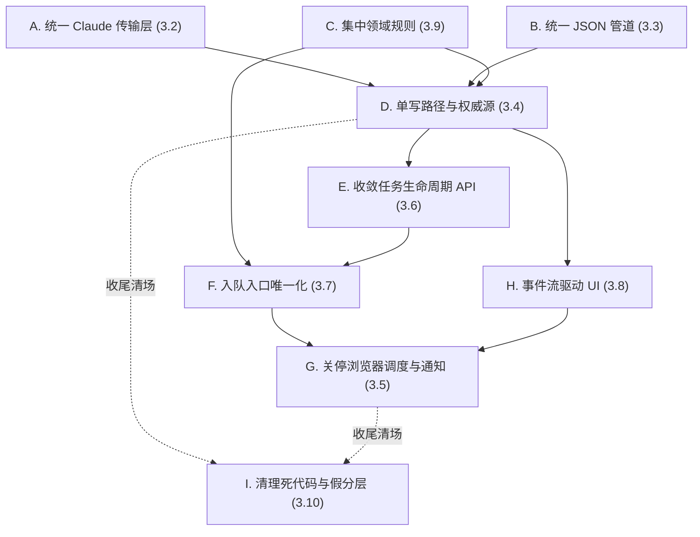

# KiKi 架构重构落地方案

> 本文是对《架构评估与重构方案》第 3 节诊断的落地版。
>
> **范围**：仅覆盖确定要做的 9 项问题（3.2、3.3、3.4、3.5、3.6、3.7、3.8、3.9、3.10）。
> **不在范围**：
> - 3.1 拆分两座巨石（`goalPlanning.ts` / `goalTaskRunner.ts`）—— 暂缓，等底座稳定后再做
> - 3.11 侧边栏聊天引擎合并 —— 暂缓
> - 3.12 规划 API 异步化 —— 暂缓
>
> 已有相关方案：
> - [`方案A-调度下沉与事件流.md`](方案A-调度下沉与事件流.md)：与本文 4.4/4.7/4.8 高度相关，本文复用其设计、补齐落地细节
> - [`server-persistence-and-sync-architecture-plan.md`](server-persistence-and-sync-architecture-plan.md)：与本文 4.4 单写路径方向一致
> - [`task_execution_unification.md`](task_execution_unification.md)：与本文 4.5/4.6 相关

---

## 1. 总体改造原则与不变量

执行过程中必须始终成立的硬约束（任何一次合并都要回头验证）：

1. **单一 Claude CLI 接口**：全仓库搜索 `spawn`/`execFile` 调用 Claude CLI 的位置，**只允许出现在一个文件里**。
2. **单一 JSON 提取入口**：全仓库搜索"从文本里抠 JSON"的逻辑，**只允许出现在一个模块里**。
3. **单一领域规则模块**：`requiresUserConfirmationToComplete`、`classifyTaskRunError`、`inferInteractionRequirement` 等纯规则函数，**只允许定义一次**。
4. **单一入队入口**：`createQueuedRuntimeJob` 等"创建队列任务"的方法 **只允许被 `startTaskAttempt` 这一个准入函数调用**。
5. **单一权威源**：任何持久化数据有且只有一处可写来源；前端 store 不再做直接 mutation，只做投影。
6. **单一调度器**：daemon `goalSchedulerEngine` 是唯一调度入口，浏览器侧调度循环不再运行。
7. **单一通知投递者**：daemon `goalNotificationWorker` 是唯一通知发送方，浏览器只负责消费 SSE 事件更新 UI。
8. **API 命令面唯一**：任务实例的取消/恢复/响应/状态迁移 **只有一组 URL** 接受请求。

每个改造任务收尾前必须用这 8 条作为 checklist 走一遍。

---

## 2. 改造顺序与依赖关系

**关键路径**：A/B/C → D → E → F → G/H → I（清场）。

A/B/C 之间无强依赖，可以并行。D 是中枢，没有 D 之前 E/F/G/H 都做不彻底。I 不是单独的 PR，而是随每个上游任务的收尾自然完成。

**建议节奏**：

- 第 1 周：A + B + C（并行，3 条独立 PR）
- 第 2–3 周：D（关键中枢，1 条主 PR + 必要的迁移 PR）
- 第 4 周：E + F（API 收敛和入队收敛，可串行也可并行）
- 第 5 周：H（事件流接全，立即感知收益）
- 第 6 周：G（在 H 验证稳定后再关停浏览器侧）
- 每条 PR 都顺手做 I 的清场动作

---

## 3. 分项改造方案

每项格式：**涉及链路 → 改造方案 → 注意事项 → 回滚方案 → 验收校验**。

---

### 3.A 统一 Claude CLI 传输层（对应原 3.2）

#### 涉及链路

| 调用方 | 当前调用方式 | 现状文件 |
|--------|--------------|----------|
| 规划/澄清/收集/JSON 修复 | `runClaudeJson` —— `spawn` + argv 传 prompt + `--output-format json` | [`src/lib/server/goalPlanning.ts`](../../src/lib/server/goalPlanning.ts)（约 851 行） |
| 任务执行流式调用 | `streamClaudeCli` —— `stream-json` + stdin 传 prompt + 事件回调 | [`src/lib/server/claudeCli.ts`](../../src/lib/server/claudeCli.ts) |
| 环境变量清洗 | `buildClaudeEnv` | [`src/lib/server/claudeEnv.ts`](../../src/lib/server/claudeEnv.ts) |
| CLI 路径解析 | `resolveCliPath` | 同上 |

下游依赖（迁移时需联动检查）：
- [`goalTaskRunner.ts`](../../src/lib/server/goalTaskRunner.ts) 中所有流式调用点
- [`goalPlanning.ts`](../../src/lib/server/goalPlanning.ts) 中所有阶段调用点
- [`taskFeedbackJudge.ts`](../../src/lib/server/taskFeedbackJudge.ts)、[`resultNotificationJudge.ts`](../../src/lib/server/resultNotificationJudge.ts)（如使用 Claude JSON 调用）

#### 改造方案

1. 新建 `src/lib/server/claude/transport.ts`，对外只暴露两个能力：
   - `runPromptJson({ prompt, runtimeEnv, abortSignal, cwd?, permissionMode? })` → 返回原始字符串 + 元信息（耗时、退出码、stderr 摘要）
   - `streamPrompt({ prompt, runtimeEnv, abortSignal, onEvent, cwd?, permissionMode? })` → 流式工具事件 + 最终结果
2. 内部统一接管：CLI 路径解析、环境变量清洗、cwd、`--allowedTools`、permission 模式、abort 信号、prompt 通过 **stdin 传输**（永远不再通过 argv，避免长 prompt 问题）。
3. `runClaudeJson` 改为薄包装，标记 `@deprecated`，逐步替换调用方；3 周内删除。
4. `streamClaudeCli` 直接迁移为 `transport.streamPrompt` 内部实现。
5. 提供唯一的"调用 trace" hook（不强制使用，但任何 telemetry/日志都从这里挂载）。

#### 注意事项

- **stdin 传输有大小限制要测**：本机 macOS 上 stdin pipe 默认 64KB，超大 prompt 需要异步写入。规划阶段的最大 prompt 可能 > 32KB，要实际压测。
- **abort 信号语义统一**：argv 路径下进程组的 kill 行为与 stdin 路径下不一定一致，要在迁移时显式测试"用户点取消"。
- **runtimeEnv 必须传完整对象**：不再容忍只传 `cliPath` 字符串的"懒"调用方式——把 runtimeEnv 作为必选参数能强制调用方思考权限模式和 cwd。
- **不要把 telemetry 写在 transport 层**：transport 只返回元信息，由调用方决定是否记录。

#### 回滚方案

- 保留 `runClaudeJson` 兼容入口 3 周，期间任何回滚只需把调用方改回老入口。
- 标记 `@deprecated` 的代码用 ESLint 规则禁止新增引用。

#### 验收校验

| 校验项 | 方法 |
|--------|------|
| 全仓库只剩一处 `spawn` Claude CLI | `rg "spawn\\(.*claude" src/` 应只命中 transport 文件 |
| 长 prompt（>40KB）可以稳定调用成功 | 写一个压测用例，连续 10 次调用 |
| 用户中途点"取消"的行为一致 | 手工测试：规划中途取消 + 任务执行中途取消，两侧子进程都被立即终止 |
| 不再有 argv 长度溢出风险 | grep 确认没有 `["-p", ..., prompt]` 这类调用 |
| 性能不退化 | 取一组目标规划用例，对比改造前后 P50/P95 耗时（误差应 <10%） |

---

### 3.B 统一 JSON 解析管道（对应原 3.3）

#### 涉及链路

| 实现位置 | 用途 | 与日志的耦合度 |
|----------|------|----------------|
| `extractBalancedJsonSnippet` @ [`goalPlanning.ts`](../../src/lib/server/goalPlanning.ts) ~972–1016 | 规划链路的 JSON 抠取 | 高（直接调 `appendGoalLog`） |
| `extractJsonObject` @ [`src/lib/server/jsonExtraction.ts`](../../src/lib/server/jsonExtraction.ts) | 任务执行链路使用 | 低 |
| 内联实现 @ [`taskFeedbackJudge.ts`](../../src/lib/server/taskFeedbackJudge.ts) | 反馈判定 | 中 |
| `parseClaudeJson` @ [`goalPlanning.ts`](../../src/lib/server/goalPlanning.ts) 1058–1192 | 多策略解析 + Claude 二次修复 | **高**（解析失败立即写日志） |

#### 改造方案

1. 把 [`jsonExtraction.ts`](../../src/lib/server/jsonExtraction.ts) 升格为唯一入口，新增 `src/lib/server/claude/jsonRepair.ts` 承载"Claude 二次修复 malformed JSON"。
2. 重构 `parseClaudeJson` 为纯函数：输入 `{ raw, schema?, allowRepair }`，输出 `{ data, strategy, attempts, diagnostics }`。**解析器不再写任何日志**。
3. 由调用方决定 telemetry 行为：规划链路在 pipeline 层包一层 `withGoalLog(parseClaudeJson)`，任务执行链路直接调底层。
4. 删除 `goalPlanning.ts` 中的 `extractBalancedJsonSnippet`、`taskFeedbackJudge.ts` 中的内联版本。
5. `jsonRepair` 内部调用 3.A 的 `transport.runPromptJson`（强依赖 A 完成）。

#### 注意事项

- **必须先合 A 再合 B**：否则 `jsonRepair` 会引入对老 `runClaudeJson` 的新引用，等于反向加重债务。
- **保留诊断信息的丰富度**：现有 `appendGoalLog` 调用记录了"用了哪种策略""第几次重试"，这些信息必须以结构化方式从 `diagnostics` 返回，否则规划链路日志会变贫瘠。
- **可选 schema 校验**：本次不引入 zod 等运行时校验库，先保持现状（手写 type guard）；diagnostics 中预留 `schemaErrors` 字段即可。
- **跨链路行为可能微妙差异**：现有 3 处实现的"括号平衡 + 转义处理"细节并不完全一致，迁移时挑选最严格的一份作为基准。

#### 回滚方案

- 删除 `goalPlanning.ts` 中老函数的 commit 单独成一条，必要时直接 revert 该 commit 即可恢复旧路径。
- 保留老函数 1 周观察期，期间打 `@deprecated` 但仍可调用。

#### 验收校验

| 校验项 | 方法 |
|--------|------|
| 只剩一处 JSON 抠取实现 | `rg "balancedJson\|extractJsonObject"` 只命中 `jsonExtraction.ts` 一处定义 |
| 解析器无任何日志副作用 | grep 确认 `jsonExtraction.ts` / `parseClaudeJson` 中没有 `appendGoalLog`、`console.*` |
| 历史"malformed JSON 修复"用例全部能解析 | 收集过去 1 个月的失败样例（如有）作为回归测试集，逐一回放 |
| 规划链路日志信息量不退化 | 改造前后做一次目标规划，对比 log 文件，关键诊断字段（策略/重试次数）必须保留 |

---

### 3.C 集中领域规则（对应原 3.9）

#### 涉及链路

`requiresUserConfirmationToComplete` 的 4 份拷贝：

| 文件 | 位置 |
|------|------|
| [`goalPlanning.ts`](../../src/lib/server/goalPlanning.ts) | ~1570 |
| [`goalTaskRunner.ts`](../../src/lib/server/goalTaskRunner.ts) | ~466（命名为 `taskRequiresUserConfirmationToComplete`） |
| [`resultNotificationJudge.ts`](../../src/lib/server/resultNotificationJudge.ts) | ~94 |
| [`taskExecution/resumeBlockedTask.ts`](../../src/lib/server/taskExecution/resumeBlockedTask.ts) | ~287 |

相关的还有：
- `classifyTaskRunError`（[`goalTaskRunner.ts`](../../src/lib/server/goalTaskRunner.ts)）
- `inferInteractionRequirement` 类逻辑（散在 runner、judge、resumeBlockedTask）

#### 改造方案

1. 新建 `src/lib/server/domain/taskPolicy.ts`，作为**纯函数模块**：
   - `requiresUserConfirmationToComplete(task)`
   - `inferInteractionRequirement(taskResult, task)`
   - `classifyTaskRunError(error, context)`
   - `shouldNotifyUser(task, taskResult)`（合并 `resultNotificationJudge` 中的同类规则）
2. 这些函数**只允许依赖**：领域类型（`Task`、`TaskResult`、`TaskInstance`）+ 常量。禁止 import IO、CLI、日志、store。
3. 4 处拷贝改为 `import { ... } from "@/lib/server/domain/taskPolicy"`。
4. 为每个函数补充 1–2 个单元测试，覆盖临界用例（如 `executionStrategy === "user_interactive"` + `requiresConfirmation === false` 的组合）。
5. 同时把可以纯函数化的规则（错误分类、通知判定）一并迁入，避免下次再做一遍。

#### 注意事项

- **4 份现有实现细节不完全一致**：在合并前要做 diff，把"哪一份是对的"明确下来；建议拉一次产品/工程对齐，记录"决定以哪份为准 + 不一致点的产品语义"，避免合并后某些场景的语义悄悄改了。
- **保持向后兼容**：如果 4 份实现里发现有 1 份是"特意的不一致"（比如 resumeBlockedTask 的判断更宽松），合并时应保留 `mode` 参数显式表达，不能简单一刀切。
- **禁止 import 循环**：domain 模块不应 import server 任何 IO 文件。

#### 回滚方案

- domain 模块本身仅是聚合，回滚只需把 import 改回原文件即可。
- 老函数保留 1 周作为兼容入口。

#### 验收校验

| 校验项 | 方法 |
|--------|------|
| 全仓库只剩一处 `requiresUserConfirmationToComplete` 定义 | `rg "function requiresUserConfirmationToComplete"` 应只有 1 行 |
| domain 模块零 IO 依赖 | `rg "from \"fs\\\|appendGoalLog\\\|spawn" src/lib/server/domain/` 应为空 |
| 单元测试覆盖率 | 每个导出函数至少 1 个 happy path + 1 个边界用例 |
| 产品行为不漂移 | 选 3 类典型任务（draft_review、confirm_action、agent_autonomous）做一次端到端，对比改造前后"是否需要确认"判定一致 |

---

### 3.D 单写路径与权威源（对应原 3.4）

> 这是本次重构的**中枢**。完成它之前，E/F/G/H 都做不彻底；完成之后，整个产品的状态心智才能稳住。

#### 涉及链路

当前任务运行态分散在 **5 处副本**：

| # | 位置 | 当前权威性 |
|---|------|-------------|
| 1 | 浏览器 [`goalStore.ts`](../../src/stores/goalStore.ts) + localStorage `kiki.goals` | 半权威（UI 直读） |
| 2 | SQLite `runtime_state_snapshots.goals` | 半权威（daemon 写） |
| 3 | SQLite `runtime_jobs` | 对"正在跑"权威，且嵌一份完整 Goal 在 `payload_json` |
| 4 | 进程内 Map + `kiki-goal-telemetry.json` | 单任务内权威 |
| 5 | workspace `task-run` 快照文件 | 调试/审计 |

桥接组件：
- [`RuntimeEventBridge.tsx`](../../src/components/providers/RuntimeEventBridge.tsx)：30s 轮询 + `mergeRemoteSnapshotWithPendingLocalGoals`（51–62 行，**local-wins** 策略）
- [`src/app/api/runtime/state/sync/route.ts`](../../src/app/api/runtime/state/sync/route.ts)：双向同步（goals 已 410）
- [`src/app/api/goals/materialize/route.ts`](../../src/app/api/goals/materialize/route.ts)：客户端 push goals

#### 改造方案

**目标态**：服务端为**唯一权威源**，前端只是"投影 + 乐观更新"。

1. 新建 `src/lib/server/services/goalRuntimeService.ts`，作为**唯一写入门面**。所有改变 goals 状态的代码都必须经过它。
   - `transitionInstance(instanceId, command, payload)` —— 实例状态命令入口
   - `materializeNewGoal(goalDraft, idempotencyKey)` —— 新目标确认入队
   - `applyExecutionResult(instanceId, result)` —— 执行结果回灌
   - `applyExecutionProgress(instanceId, progress)` —— 进度更新
   - 每个方法**内部按固定顺序执行**：① 更新 `runtime_jobs`（如适用） ② 投影 `runtime_state_snapshots` ③ 追加 `goal_event_log` ④ 返回新版本号
2. 删除以下路径上"直接写 snapshot"或"直接创建 runtime_jobs"的代码：
   - API 路由（`materialize`、`instances/*`、`tasks/*`、`feedback`、`tasks/execute`）
   - daemon worker（[`taskDispatchWorker.ts`](../../src/lib/server/worker/taskDispatchWorker.ts)、[`goalSchedulerEngine.ts`](../../src/lib/server/worker/goalSchedulerEngine.ts)）
   - 全部改为调用 `goalRuntimeService`
3. 前端 [`goalStore.ts`](../../src/stores/goalStore.ts)：
   - 移除所有"直接修改 goals 数组并 persist"的 action
   - 保留 selectors、derived state、乐观 UI patch（仅在乐观期内可写，收到 SSE 事件后被覆盖）
   - 持久化 key `kiki.goals` 保留作为离线只读缓存，但 hydrate 时**只在 SSE/snapshot 都未到达前使用**
4. 删除 [`RuntimeEventBridge.tsx`](../../src/components/providers/RuntimeEventBridge.tsx) 中的 `mergeRemoteSnapshotWithPendingLocalGoals`，冲突一律以服务端版本号为准。
5. 关闭 `runtime_state_snapshots` 的 `conversations` 字段（孤儿写入，参考 [`方案A` §0.0](方案A-调度下沉与事件流.md) 偏差 ④），要么消费要么删除——本次选择删除。

#### 注意事项

- **不要触碰 `goal_event_log` 的 schema**：[`方案A`](方案A-调度下沉与事件流.md) 已经在做事件日志的设计；本次只**复用**该表的写入接口（如果方案 A 已落地）或**预留**接口位置（如果还没落地）。本任务的目标是建立单写路径，事件日志本身的演进交给方案 A。
- **乐观更新的边界要画清**：前端 store 的"乐观 patch"必须带版本号；收到 SSE 后用 last-write-wins 策略（基于 `updatedAt` 时间戳）。要写明：什么样的字段允许乐观（如 UI 标记），什么样的不允许（如 instance 状态）。
- **迁移期间双写要监控**：第一阶段先让所有写入"走 service + 写老 snapshot"，第二阶段切流，第三阶段删除老写入路径。每个阶段间隔至少 3 天观察。
- **localStorage 兼容**：现有用户的 `kiki.goals` 数据如何处理？方案：保留只读 hydrate，但在收到第一份服务端 snapshot 后立即清空 localStorage。
- **依赖前置任务**：必须在 A/B/C 完成后启动，否则 service 内部仍会引用混乱的 CLI/JSON/规则。

#### 回滚方案

- 三阶段切流的每一阶段都可独立回滚：
  - 阶段 1 回滚 = revert service 调用，老路径仍在
  - 阶段 2 回滚 = 关闭 feature flag，恢复双写
  - 阶段 3 回滚 = 重新启用老 snapshot 写入代码（保留 1 个月再删除）

#### 验收校验

| 校验项 | 方法 |
|--------|------|
| 全仓库只剩一处 `upsertGoalsSnapshot` 调用 | `rg "upsertGoalsSnapshot\\("` 应只命中 `goalRuntimeService` 内部 |
| 全仓库只剩一处 `createQueuedRuntimeJob` 调用 | 同上（同时也是 F 的验收项） |
| 前端 store 无 mutation action | 检查 `goalStore.ts` 导出 action，应只剩 selector + 乐观 patch |
| 任务状态"反复横跳"现象消失 | 准备 5 个真实长程目标用例，手动观察 1 小时无回退 |
| localStorage 不再覆盖服务端 | 手工测试：在浏览器里改 localStorage 中 goals 字段，刷新后服务端版本胜出 |
| 并发同时写不会丢更新 | 写一个集成测试：两个 API 并发对同一 instance 发命令，最终状态确定且事件日志完整 |

---

### 3.E 收敛任务生命周期 API（对应原 3.6）

#### 涉及链路

| 当前 URL | 当前职责 | 计划处理 |
|---------|---------|---------|
| `POST /api/goals/tasks/cancel` | 取消 job → snapshot 写 cancelled | 改为薄包装转发 |
| `POST /api/goals/tasks/resume` | 透传 resumeBlockedTask | 改为薄包装转发 |
| `POST /api/goals/instances/[id]/cancel` | 写事件 + snapshot paused + 取消 job | **保留为主入口** |
| `POST /api/goals/instances/[id]/transition` | 任意状态迁移 | **保留为主入口** |
| `POST /api/goals/instances/[id]/respond` | 用户响应 | **保留为主入口**，更名为 `respond`（已是） |
| `POST /api/goals/plan/resume` | 规划从断点恢复（重复） | 改为薄包装到 `plan` 的 `resumeFromCheckpoint` 分支 |
| `GET /api/goals/progress` + `GET /api/goals/tasks/progress` | 进度查询（两份） | 合并为 `GET /api/goals/instances/[id]/runtime` |

#### 改造方案

1. **以实例为主语**：保留 `/api/goals/instances/[instanceId]/{cancel,resume,respond,transition}` 作为唯一命令面。
2. 老路径 `tasks/cancel`、`tasks/resume` 改为薄包装：
   - 接收老参数（如 `requestId`、`taskInstanceId`）
   - 内部解析出 `instanceId` 后转发到新路径
   - 返回头加 `Deprecation: true` + `Sunset: <日期>` + `Link: <新路径>`
3. 在前端搜索调用方，逐步迁移到新路径，**保留 4 周观察期**。
4. 进度查询：新增 `GET /api/goals/instances/[id]/runtime` 返回 `{ progress, logs, trajectory, blocker, waitingReason }`；老的两个 progress API 改为薄包装。
5. 在领域层固化 `TaskInstanceStatus ↔ RuntimeJobStatus` 的映射表，作为常量导出，避免再出现"取消是 cancelled 还是 paused"的随意决策：

   | 用户意图 | RuntimeJob 状态 | TaskInstance 状态 |
   |----------|-----------------|-------------------|
   | 用户主动取消 | `cancelled` | `paused`（保留可恢复语义） |
   | 系统超时取消 | `cancelled` | `paused` + `waitingReason: timeout` |
   | 任务执行失败 | `failed` | `error` |
   | 用户回答阻塞问题 | `queued`（重新入队） | `pending` |
   | 任务完成 | `completed` | `completed` |

#### 注意事项

- **`tasks/feedback` 不在本任务的"老路径"列表中**：它有 `rerun` 旁路，属于 F 的工作。本任务只处理生命周期 API。
- **薄包装不能含业务逻辑**：如果发现老路径里有"额外做某件事"的代码，要么把这件事迁移到新路径，要么明确这件事属于"已废弃行为"——绝不允许"新老路径行为不一致"。
- **前端调用方迁移要有审计**：每个迁移 PR 都列出"删除了哪些老 API 调用"，避免漏掉。
- **依赖 D 完成**：因为新入口都要走 `goalRuntimeService`，没有 D 就无法收敛。

#### 回滚方案

- 老路径保留 4 周后才删除，期间任何回滚只需把前端调用切回老路径。
- 删除 PR 单独成一条，便于 revert。

#### 验收校验

| 校验项 | 方法 |
|--------|------|
| 前端无任何 `tasks/cancel`、`tasks/resume`、`plan/resume`、老 progress API 的调用 | `rg "tasks/cancel\\\|tasks/resume\\\|plan/resume\\\|goals/progress" src/` 应只命中文档和薄包装本身 |
| 老路径返回 Deprecation 头 | 手工 curl 验证 |
| `cancel` 行为确定 | E2E 用例：在不同 instance 状态下点取消，验证最终状态符合映射表 |
| 进度查询返回完整字段 | 取一个执行中的 instance，调用新 runtime API，校验返回包含 progress/logs/trajectory/blocker/waitingReason |

---

### 3.F 入队入口唯一化（对应原 3.7）

#### 涉及链路

当前会创建 `runtime_jobs` 记录的入口：

| 调用方 | 文件 | 是否经过 `startTaskAttempt` |
|--------|------|------------------------------|
| `POST /api/goals/tasks/execute` | [`route.ts`](../../src/app/api/goals/tasks/execute/route.ts) | ✅ |
| daemon scheduler | [`goalSchedulerEngine.ts`](../../src/lib/server/worker/goalSchedulerEngine.ts) | ✅ |
| `POST /api/goals/tasks/feedback` (rerun) | [`route.ts`](../../src/app/api/goals/tasks/feedback/route.ts) | ❌ **旁路** |
| `resumeBlockedTask` 部分分支 | [`resumeBlockedTask.ts`](../../src/lib/server/taskExecution/resumeBlockedTask.ts) | ❌ **旁路** |

#### 改造方案

1. 把 `createQueuedRuntimeJob` 改为 repository 内部可见（移除 export 或改名为 `_createQueuedRuntimeJobInternal`），ESLint 规则禁止外部直接 import。
2. `startTaskAttempt` 扩展 `triggerSource` 字段：`"user" | "scheduler" | "feedback_rerun" | "resume_after_block"`。
3. `tasks/feedback` 的 rerun 分支改写为 `startTaskAttempt({ triggerSource: "feedback_rerun", ...overrides })`。
4. `resumeBlockedTask` 中 re-queue 的分支改写为 `startTaskAttempt({ triggerSource: "resume_after_block", ...overrides })`。
5. `startTaskAttempt` 内部根据 `triggerSource` 决定**是否绕过某些检查**（比如 resume 时已经验证过依赖，可以跳过 dependency check），但所有跳过都要**显式声明**在准入函数内，禁止调用方自己 hack。
6. 准入函数同时承担：检查依赖、检查 `autoRunDisabled`、检查重复运行、生成 requestId、记录 admission 日志。

#### 注意事项

- **不要在 startTaskAttempt 里塞业务分支**：所有 `triggerSource` 相关的差异都以策略对象注入（`AdmissionPolicy[triggerSource]`），便于未来扩展和单测。
- **依赖检查的边界要清晰**：feedback rerun 是否要重新检查依赖？产品决策为"是"（依赖可能已经过期），需要在策略表里明确声明。
- **依赖 D 完成**：因为入队后还需要写 goal_event_log，必须走 `goalRuntimeService`。

#### 回滚方案

- ESLint 规则可临时关闭；老 export 保留 1 周作为兼容入口。
- feedback/resume 的旁路逻辑可单独 revert。

#### 验收校验

| 校验项 | 方法 |
|--------|------|
| 全仓库只有一处调用 `createQueuedRuntimeJob` | `rg "createQueuedRuntimeJob\\("` 应只命中 `startTaskAttempt` 内部 |
| `triggerSource` 在事件日志中可查询 | 跑一次 feedback rerun，查 `goal_event_log` 应能看到 `triggerSource: "feedback_rerun"` |
| 准入规则一致 | 测试：把某任务的 `autoRunDisabled` 设为 true，分别通过 execute / scheduler / feedback / resume 四种入口尝试启动，**只有显式声明跳过该检查的入口才能启动** |
| 没有"幽灵 job"出现 | 跑 24 小时长程目标，对比 `runtime_jobs.count` 与 `goal_event_log` 中 `job.created` 事件数，必须一致 |

---

### 3.G 关停浏览器调度与通知副本（对应原 3.5）

> **必须在 H 完成且稳定运行 1 周后再做**——否则关停浏览器侧后，UI 既收不到通知也无法实时更新。

#### 涉及链路

| 浏览器侧组件 | 当前职责 | 计划处理 |
|------------|----------|----------|
| [`GoalSchedulerRuntime.runGoalSchedulerCycle`](../../src/components/providers/GoalSchedulerRuntime.tsx) ~309–447 | 浏览器调度循环（默认 env 关闭） | **直接删除** |
| `GoalSchedulerRuntime.deliverPendingTaskNotifications` ~180–243 | 通知投递（默认开启） | **删除**，改为消费 SSE |
| `GoalSchedulerRuntime` watchdog 逻辑 ~245–307 | 只加 inbox 提示 | **删除**，统一由 daemon 处理（暂停 + 提醒） |
| daemon 侧 [`goalNotificationWorker.ts`](../../src/lib/server/worker/goalNotificationWorker.ts) | 已存在但需 env 开启 | **改为默认开启**，作为唯一通知投递者 |

#### 改造方案

1. daemon `goalNotificationWorker` 默认启动（不再依赖 `NEXT_PUBLIC_KIKI_NOTIFICATIONS_RUNTIME === "daemon"`）。
2. daemon watchdog 完整化：超时任务统一处理为 "实例置为 `paused` + `waitingReason: "timeout"` + 收件箱产生提醒"。这一步可能需要扩展 [`goalSchedulerEngine.ts`](../../src/lib/server/worker/goalSchedulerEngine.ts) 的循环逻辑（参考 [`方案A` §1.2](方案A-调度下沉与事件流.md)）。
3. 浏览器 [`GoalSchedulerRuntime.tsx`](../../src/components/providers/GoalSchedulerRuntime.tsx)：
   - 删除 `runGoalSchedulerCycle`、`deliverPendingTaskNotifications`、watchdog 逻辑
   - 仅保留"通过 SSE 接收通知事件 → 更新 inbox/会话卡片 UI"的纯展示逻辑
   - 文件可重命名为 `GoalRealtimeBridge.tsx` 以反映新职责
4. `NEXT_PUBLIC_KIKI_ENABLE_BROWSER_SCHEDULER` 保留作为紧急回滚 kill switch，但代码路径**只剩 fallback 分支**（如 daemon 心跳 30s 无响应时启用极简模式）。

#### 注意事项

- **多浏览器窗口的去重**：当前同一用户开多个 tab，每个 tab 都跑通知投递——非常容易重复。daemon 单一投递后此问题消失，但要测试"两个 tab 同时打开时只收到一次通知"。
- **离线场景**：用户关掉浏览器后，daemon 投递的通知积压在数据库；用户打开浏览器时通过 SSE 的"重连补发"机制一次性拿到（参考 [`方案A` §1.3](方案A-调度下沉与事件流.md)）。
- **依赖 H 已稳定**：必须先确认事件流接全，否则 UI 会失明。
- **inbox store 转投影模式**：从这一步开始，[`inboxStore.ts`](../../src/stores/inboxStore.ts) 不再扫描 goal 树自己造提醒，改为由 SSE 事件 `notification.delivered` 派生。

#### 回滚方案

- 通过 `NEXT_PUBLIC_KIKI_ENABLE_BROWSER_SCHEDULER=1` 可临时启用 fallback 模式。
- daemon worker 启动开关可独立回退。

#### 验收校验

| 校验项 | 方法 |
|--------|------|
| 浏览器关闭 4 小时再打开 | 应能看到这段时间产生的所有通知（inbox 内容、会话卡片） |
| 同一用户开 3 个浏览器 tab | 同一通知只投递一次（不重复显示） |
| 同时关闭浏览器调度后，长程目标继续推进 | 跑一个 8 小时目标，关闭浏览器，第二天验证任务 instance 数量、状态、产物完整 |
| 浏览器代码无调度循环 | `rg "runGoalSchedulerCycle\\\|deliverPendingTaskNotifications" src/` 应为空（或仅命中 git 历史） |
| 超时 watchdog 行为统一 | 准备一个超时任务，验证 daemon 将其置为 `paused` 且收件箱有提醒 |

---

### 3.H 事件流驱动 UI（对应原 3.8）

> **ROI 最高的一项**——后端事件已经在写，前端把通道接全立刻能获得秒级反应。

#### 涉及链路

| 服务端事件写入点 | 当前是否被前端消费 |
|----------------|---------------------|
| `instance.status_changed` @ [`runtimeJobsRepository.ts`](../../src/lib/server/repositories/runtimeJobsRepository.ts) ~424 | ❌ |
| `instance.timeout_paused` | ❌ |
| `schedule.event_synthesized` | ❌ |
| `instance.progress` | ❌ |
| `notification.delivered` | ✅（唯一被消费的） |

前端入口：[`RuntimeEventBridge.tsx`](../../src/components/providers/RuntimeEventBridge.tsx) 的 `applyGoalEvent`，136–137 行后直接 `return`。

#### 改造方案

1. 扩展 `applyGoalEvent` 处理至少这些事件 kind（按优先级）：
   - `instance.status_changed` → 更新 goalStore 中对应 instance 的状态（仅 patch 该 instance，不 replace 整树）
   - `instance.progress` → 更新进度条字段
   - `instance.timeout_paused` → 更新状态 + 加 waitingReason
   - `schedule.event_synthesized` → 更新 scheduleStore
   - `notification.delivered` → 已支持，保留
2. **事件 kind 拆分**：在服务端把 `instance.status_changed` 进一步拆为：
   - `job.status_changed`（job 层生命周期：queued → running → cancelled）
   - `instance.status_changed`（业务层状态：pending → in_progress → completed/awaiting_user/paused）
   避免现在同一个字段下混用两种枚举（参考原 plan §3.5 末段问题描述）。
3. 30s 轮询降级为 SSE 断线时的兜底（监听 EventSource 的 `error` 事件，仅在断线超过 60s 时启动）。
4. 服务端 SSE 实现：复用 [`src/lib/server/sse.ts`](../../src/lib/server/sse.ts)，让 [`events/stream/route.ts`](../../src/app/api/goals/events/stream/route.ts) 不再内联 `encodeSse`。
5. 短期内可先做事件类型的最小子集（`instance.status_changed` + `instance.progress`），先把"任务完成 30 秒才更新"的痛点解掉，再补齐其他事件。

#### 注意事项

- **事件回放的幂等性**：SSE 断线重连后会重发部分事件，前端必须按 `eventId` 去重。
- **事件顺序**：同一 instance 的事件顺序必须保证，跨 instance 不要求；前端 reducer 按 `(instanceId, eventId)` 去重 + 按 `createdAt` 排序应用。
- **乐观更新冲突**：前端某个 action 已经乐观更新了状态，紧接着 SSE 来了一份"过期"的状态——必须比较 `updatedAt` 时间戳，旧的直接丢弃。
- **依赖 D 完成**：因为新事件的写入来自 `goalRuntimeService`。如果 D 还没完，可以先用现有 `runtimeJobsRepository` 中的事件写入点做最小子集。

#### 回滚方案

- 关闭新事件处理可通过 feature flag（如 `NEXT_PUBLIC_KIKI_SSE_EVENTS_FULL`）一键回到只处理 notification 的旧行为。
- 30s 轮询代码保留，可立即恢复为正常路径。

#### 验收校验

| 校验项 | 方法 |
|--------|------|
| 任务完成后 UI 更新延迟 | 用秒表测，从 daemon 写完到 UI 显示完成应 <2 秒（之前是最高 30 秒） |
| 多 tab 同步 | 同时开 2 个 tab，在 A tab 触发任务，B tab 应同步看到状态变化 |
| 断线重连不丢事件 | 手动断网 30 秒再恢复，期间产生的状态变化应在重连后 5 秒内同步到 UI |
| 30s 轮询确认降级 | 正常运行期间观察 network 面板，应基本无 `runtime/state` 请求 |
| 事件去重正确 | 故意重放同一事件 10 次，UI 状态不抖动 |

---

### 3.I 清理死代码与假分层（对应原 3.10）

> **不要单开 PR 集中删**——作为每个 A–H 任务收尾时的"清场"动作自然完成，避免独立 PR 的 review 噪音。

#### 涉及链路

| 死代码/假分层 | 清场时机 |
|----------------|---------|
| [`src/lib/server/taskRunner/`](../../src/lib/server/taskRunner/) 整个目录（Runner 接口 + stub） | 跟随 3.A（CLI 统一）完成时一并删除 |
| [`src/stores/taskInstanceStateMachine.ts`](../../src/stores/taskInstanceStateMachine.ts)（零引用） | 跟随 3.D 完成时删除 |
| [`src/bin/kiki-runtime-daemon.ts`](../../src/bin/kiki-runtime-daemon.ts) vs [`scripts/start-worker.ts`](../../scripts/start-worker.ts)（重复入口） | 跟随 3.G 完成时合并 |
| [`src/stores/chatStore.ts`](../../src/stores/chatStore.ts)（仅 mock 使用） | 跟随 3.D 完成时打 demo-only 标签或删除 |
| `runtime_state_snapshots.conversations` 字段（孤儿写入） | 跟随 3.D 完成时删除 |

#### 改造方案

按"清场时机"列在对应主任务的收尾 commit 中完成。每次清场要：
1. 确认零引用（`rg` 验证）
2. 删除文件 / 字段
3. 在 PR 描述里写明"清场动作"，便于 review

#### 注意事项

- **不要保留 `Runner` 接口"以备未来"**：未来真要做插件化，重新设计接口比兼容旧 stub 更便宜。
- **conversations 孤儿字段的迁移数据**：先确认这些字段是否包含未来要恢复的数据；如果纯粹是写入但从不读取，直接 schema migration 删字段。
- **daemon 入口合并后更新文档**：包括 [`README.md`](../../README.md)、[`packaging/macos/`](../../packaging/macos/)、CI 脚本等。

#### 回滚方案

- 删除前先 git tag 标记一份"deletion checkpoint"，回滚就是 revert + restore tag。

#### 验收校验

| 校验项 | 方法 |
|--------|------|
| 零引用文件全部删除 | `rg "from.*taskRunner\|from.*taskInstanceStateMachine\|from.*chatStore"` 应为空 |
| daemon 入口只剩一个 | `package.json` 的 `daemon` / `worker` 脚本指向同一文件 |
| 文档同步更新 | README、PROJECT_OVERVIEW、packaging 文档都指向新入口 |

---

## 4. 全局端到端校验方案

每个主任务（A–H）完成后跑一遍。

### 4.1 自动化检查（CI 集成）

| 检查项 | 实现 |
|--------|------|
| 不变量约束 1（CLI 单点） | grep 规则：`spawn.*claude` 只允许出现在 `claude/transport.ts` |
| 不变量约束 2（JSON 单点） | 同上，对 `jsonExtraction` 等 |
| 不变量约束 3（领域规则单点） | ESLint 规则：禁止在 `domain/` 之外定义 `requiresUserConfirmation*` |
| 不变量约束 4（入队单点） | ESLint 规则：禁止 import `createQueuedRuntimeJob` 来自外部 |
| 不变量约束 5（前端 mutation 单点） | ESLint 规则：goalStore 不导出非 selector 函数 |
| TypeScript 编译 | `pnpm build` 0 error |
| Lint | `pnpm lint` 0 error |

### 4.2 集成测试（手工或脚本）

| 用例 | 步骤 | 期望 |
|------|------|------|
| 长程目标完整生命周期 | `/goal 学习 React`，完成信息收集 → 确认规划 → 关闭浏览器 4h → 重新打开 | 期间所有任务 instance 状态、通知、产物完整可见 |
| 多 tab 一致性 | 开 3 个 tab 进入同一目标 | 在 tab A 触发任务，tab B/C 在 2s 内看到状态变化 |
| 取消任务行为 | 在 instance 不同状态下点取消 | 行为符合 §3.E 映射表 |
| Feedback rerun 准入 | 把任务 `autoRunDisabled` 设为 true 后通过 feedback rerun | 应被准入规则拦截或显式声明跳过 |
| 断线重连 | 主动断网 30s | 重连后 5s 内 UI 同步至最新状态 |
| 并发取消 | 同一 instance 两个 API 并发取消 | 事件日志中只产生一次 `cancelled`，状态确定 |

### 4.3 性能基线

| 指标 | 基线 | 目标 |
|------|------|------|
| 任务完成到 UI 显示延迟 | <30s（当前）| <2s |
| 目标规划 P95 耗时 | 当前值 | 不退化（±10%） |
| 30s 轮询请求数 | 当前数 | 减少 90% 以上 |

### 4.4 灰度策略

每个主任务都建议引入一个 feature flag，灰度顺序：
1. 开发环境：合 PR 后立即启用
2. 本地体验（自己用）：1 天
3. 灰度用户：3 天
4. 全量：1 周观察期

---

## 5. 风险与不确定性

| 风险 | 缓解 |
|------|------|
| 3.D 单写路径牵动面太大，可能出现"做到一半发现某条链路无法迁移" | 第一步用一周做完整调用图清单（所有写 goals 的位置），评估完再启动 |
| stdin 传超长 prompt 在 Windows/Linux 上行为可能不同 | 现阶段 KiKi 仍是 macOS 优先，先保证 macOS 行为，其他平台暂记 backlog |
| 事件日志（goal_event_log）的 schema 是否复用方案 A | 启动 3.D 前先与方案 A 推进者对齐，确认 schema 版本号和迁移路径 |
| 关停浏览器调度后，长期未升级版本的用户体验受影响 | feature flag + 服务端检测，老前端可继续走兼容路径 1 个月 |
| 重构期间产品需求变化 | 每个 P0/P1 PR 范围严格限制，禁止顺手加业务功能 |

---

## 6. 一句话总结

> 这次重构不是为了"代码看着更整齐"，而是为了让 **状态可信、调度可控、事件可观察**——这是 KiKi 从"高保真原型"真正走向"本地 Agent OS"必须迈过的一步。底座（A/B/C）→ 中枢（D）→ 入口（E/F）→ 调度（G）→ 实时（H）→ 清场（I），按此顺序，每一步都能独立上线、独立回滚、独立验收。
