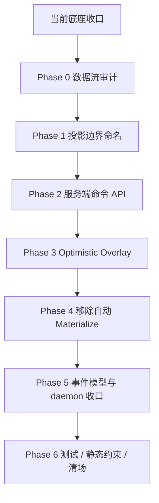

# 架构重构剩余工作推进规划

## 背景

本文承接 [`architecture-refactor-execution-plan.md`](./architecture-refactor-execution-plan.md) 的执行进展，用于记录当前仍未完成的工作、推荐推进顺序和每阶段验收标准。

当前底座已基本完成主链路迁移：Claude transport、JSON 修复模块、领域规则、旧生命周期 API 响应头、SSE 事件桥、daemon 通知/超时、单写 service 门面、服务端命令 API、goalStore 投影化和 optimistic overlay 都已落地。

真正剩余的工作集中在三类：

- 浏览器级 E2E / 手工验收。
- 关键策略与边界场景测试。
- 可观测性产品化、提交整理和最终清场审计。

`goalStore` 投影化是一次数据权威源迁移，不是普通清场。详细专项方案见 [`goal-store-projection-refactor-plan.md`](./goal-store-projection-refactor-plan.md)。

## 当前状态

### 已基本落地

- 3.A Claude CLI 传输层已统一到 `src/lib/server/claude/transport.ts`。
- 3.B JSON 管道已新增 `src/lib/server/claude/jsonRepair.ts`，但仍需补回归样例测试。
- 3.C 领域规则已集中到 `src/lib/server/domain/taskPolicy.ts`，但仍需补边界单测。
- 3.D 已有 `src/lib/server/services/goalRuntimeService.ts` 写入门面，前端 goal 事实源已迁为服务端投影。
- 3.E 旧生命周期 API 已迁移前端调用并补 `Deprecation` / `Sunset` / `Link` 响应头。
- 3.F runtime job 入队与更新已基本收敛到 service/repository internal 组合。
- 3.G 浏览器调度、通知、watchdog 已从 `GoalSchedulerRuntime` 关停，daemon 侧承担主要职责。
- 3.H `RuntimeEventBridge` 已消费多类事件，并支持 pending event replay、SSE 断线后轮询兜底。
- 3.I 清场已完成主要路径，包括删除假 `taskRunner` 目录、删除零引用 state machine、删除 `chatStore`、移除 snapshot `conversations` key。

### 仍未完成

- 浏览器级 E2E 或手工验收尚未固定，仍需覆盖真实断网重连、多 tab 通知去重、用户操作失败回滚、刷新后 overlay 不持久化等场景。
- `jsonRepair`、`taskPolicy`、SSE pending replay、并发取消、feedback rerun 等关键路径仍缺正式测试。
- 可观测性仍停留在最小运行期指标，尚未形成服务端聚合、dashboard、性能基线和长程运行观察记录。
- 前端数据层规范尚未统一，当前仍是 fetch/helper + Zustand projection，是否引入或约束 React Query/SWR 需要后续决策。
- 最终提交前仍需做清场审计与变更拆分，确认 DB 运行态文件只以 `.gitignore` 和移除跟踪的形式进入提交。

### 已补齐的原遗留项

- `RuntimeEventBridge` 已移除 `goalMaterializeKey`、`mergeRemoteSnapshotWithPendingLocalGoals` 与自动 materialize 逻辑。
- `/api/goals/materialize` 与前端 `materializeGoalSnapshot` helper 已删除，goal 创建/确认/结构编辑统一走 `/api/goals/commands`。
- 任务编辑、删除、新增子目标、新增任务、规划确认、规划调整、会话级联清理等用户操作已迁到服务端命令 API。
- 结构命令已支持并传递 `baseRevision`，服务端对 revision 冲突返回 409。
- `instance.status_changed` 与 `job.status_changed` 已拆分，runtime job 状态不再复用业务 instance 状态事件。
- `package.json` 中 `worker` / `daemon` 已指向同一 runner。
- 已新增 `pnpm verify:architecture`，覆盖 spawn、snapshot 写入口、job internal 写入口、materialize 禁用和前端 legacy mutation 订阅等约束。
- localStorage 中历史 goal 草稿或 pending goal 已按产品决策直接清理，不做迁移/恢复提示。
- `goalStore` 内部 legacy mutation shim 已移除，运行态状态/进度/通知更新收敛为 `apply*Projection` 内部实现。
- 会话删除已新增 `pendingConversationGoalDeletes` overlay，删除确认后关联 goals 会先从 UI 隐藏，服务端失败时回滚。
- SSE cursor 已通过 `goalEventCursor.ts` 持久化，并在 `RuntimeEventBridge` 中接入多 tab 同步与严格去重。
- `chatStore` 已删除，`FreeformChatView` 已迁为组件内 transient state。
- 已接入最小运行期指标，`RuntimeEventBridge` 会暴露 `window.__KIKI_RUNTIME_EVENT_METRICS__` 并周期写入 localStorage。
- SQLite 运行态文件已加入 `.gitignore`，`data/*.db`、`data/*.db-shm`、`data/*.db-wal` 不再作为业务代码提交。

### 系统性遗留问题

这部分不是某个文件的问题，而是底座本身需要继续产品化的规则：

- 事件与 snapshot 的命令写入已进入事务，但仍需补长程运行观察和失败恢复验收。
- SSE cursor 已有持久化和多 tab 同步策略，但仍需真实浏览器断线重连验收。
- 每个 Phase 的回滚开关、风险预案和上线观察指标仍需要整理为最终验收清单。
- 命令 API 与前端数据层（fetch 直调 / react-query / SWR）的长期关系尚未统一。
- 关键事件投递、命令成功率、SSE 中断率等可观测性仍需从最小指标升级为可查询的聚合视图。

## 推进总览

## 跨阶段总规则

下列规则在每个 Phase 都适用，避免散落在各阶段中重复：

- **事实源**：`goal_event_log` 是变更事实，`runtime_state_snapshots.goals` 是当前投影，所有写入由 `goalRuntimeService` 统一编排。
- **写入顺序**：先 append event，再 update snapshot，写入失败时不允许仅有 snapshot 没有 event。
- **幂等键**：所有状态变更类命令必须携带 `Idempotency-Key`；命令侧记录已处理键，避免重复投递造成重复事件。
- **冲突策略**：结构覆盖类命令必须携带 `baseRevision` 或实体级 revision，冲突时返回明确错误，不在前端启发式合并。
- **回滚开关**：每个 Phase 的关键开关（自动 materialize、optimistic overlay、daemon 唯一生产者）保留可恢复路径，遇线上问题可在不回滚代码前提下关闭新行为。
- **静态约束**：`spawn` / `upsertGoalsSnapshot` / runtime job enqueue / 领域规则 / JSON 抠取等关键入口的白名单文件由 CI grep 守护，新增文件需要审批。

## Phase 0：数据流审计

### 目标

冻结现状，先做调用图，不改行为。

### 工作内容

- 列出所有 `useGoalStore` mutation callsite。
- 将 mutation 按职责分类：
  - 投影回灌。
  - 用户命令。
  - 本地草稿。
  - demo-only。
- 明确每个 mutation 的迁移结论：
  - 保留为 projection 入口。
  - 迁移到服务端命令 API。
  - 改为 optimistic overlay。
  - 删除或迁移 demo。
- 明确本地 DB 文件、计划文档、新增源码文件的提交边界，避免无关二进制变更混入。

### 验收标准

- 产出完整 mutation callsite 迁移矩阵。
- 每个 mutation 都有“保留 / 迁移 / 删除 / 暂缓”的明确结论。
- 不改变现有用户行为。

## Phase 1：投影边界命名

### 目标

先让代码结构表达“服务端投影应用”和“用户命令”不同。

### 工作内容

- 在 `goalStore` 中新增或重命名投影入口：
  - `applyGoalsProjection`
  - `applyInstanceStatusProjection`
  - `applyInstanceProgressProjection`
  - `applyNotificationProjection`
- 将 `RuntimeEventBridge` 的 SSE/snapshot 回灌改为只调用 projection 命名入口。
- 将用户动作类 mutation 标记为 legacy command shim，并写明替代 API。
- 增加开发期 guard，避免回灌期间误触发用户命令入口。

### 验收标准

- SSE/snapshot 回灌路径只调用 projection 类方法。
- 用户操作路径仍可工作。
- legacy command shim 均有迁移目标注释或清单记录。

## Phase 2：服务端命令 API

### 目标

让当前依赖本地 mutation 的写操作逐个迁到服务端。

### 工作内容

- 补齐 goal/task 命令 API：
  - 创建 goal 草稿。
  - 确认 goal 计划。
  - 更新 task。
  - 删除 task。
  - 新增 subGoal / task。
  - 手动启动、暂停、恢复、重跑 instance。
  - 用户确认或提交任务结果反馈。
- 所有命令统一经过 `goalRuntimeService.ts` 写 snapshot 和 event log。
- 所有状态变更类命令强制 `Idempotency-Key`。
- 对会覆盖结构的命令增加 `baseRevision` 或实体级 revision。
- 前端组件逐个从 `goalStore.updateTask`、`goalStore.deleteTask` 等本地写入切到命令 API。

### 验收标准

- 用户动作不再直接生成最终 canonical goal/task/instance。
- API route 不直接写 snapshot repository。
- 冲突返回可识别错误，前端能 refresh 或 retry。

## Phase 3：Optimistic Overlay

### 目标

保留即时 UI，但不让本地 optimistic 数据伪装成服务端事实。

### 工作内容

- 新增轻量 overlay 状态，例如 `pendingGoalCommands` 或 `goalOptimisticOverlay`。已落地 `pendingTaskCreates`、`pendingSubGoalCreates`、`pendingTaskUpdates`、`pendingTaskDeletes`、`pendingGoalWorkflows`、`pendingConversationGoalDeletes`。
- 用户提交命令后记录 pending command，而不是直接改写 canonical goals。新增任务、新增子目标、编辑任务、删除任务、规划确认、规划调整和会话删除级联隐藏流程已落地。
- UI selector 渲染 `serverProjection + optimisticOverlay`。目标页已合成 canonical subGoals + pending subGoals，任务列表已合成 canonical tasks + pending task overlays，工作流区域已合成 pending workflow，通用 goal 读取入口已通过 `selectVisibleGoals` 隐藏待删除会话的关联 goals。
- 命令成功后等待 SSE/snapshot 确认并清理 overlay。主要结构命令、规划 workflow 命令和会话删除级联已落地。
- 命令失败或冲突时回滚 overlay，并提示具体原因。主要结构命令、规划 workflow 命令和会话删除级联已落地。
- localStorage 历史 goal 已明确直接清理，不再迁移。

### 验收标准

- 刷新页面不会把未确认 optimistic 数据误认为已持久化。
- 同一个命令重复提交可通过 idempotency 去重。
- 服务端事件到达后 overlay 能稳定消失，不产生重复 instance/task。

## Phase 4：移除自动 Materialize

### 目标

切断“本地 goal 自动反向写服务端”的旧链路。

### 工作内容

- 删除 `RuntimeEventBridge` 中基于 `goalMaterializeKey` 的自动 materialize 逻辑。
- 删除 `mergeRemoteSnapshotWithPendingLocalGoals` 启发式合并。
- canonical goals 完全来自服务端 snapshot。
- pending 状态只来自 optimistic overlay。
- `/api/goals/materialize` 进入弃用流程，补 deprecated headers，最终删除。
- 处理 localStorage 中已有的 goal 草稿和 pending goal：按产品决策直接清理，不迁移、不提示恢复。

### 风险与回滚

- 风险：旧浏览器缓存中的 localStorage-only goal 会被丢弃。
- 回滚：如需临时查看旧缓存，只能人工从浏览器 localStorage 导出，不恢复自动 materialize 链路。

### 验收标准

- `RuntimeEventBridge` 不再调用 `materializeGoalSnapshot`。
- hydrate 与轮询只做服务端投影替换，不再合并隐式本地 goal。
- 本地 confirmed goal 不会绕过命令 API 写入服务端。
- localStorage 残留草稿有明确处理路径：直接清理，不进入 canonical goals。

## Phase 5：事件模型与 daemon 收口

### 目标

解决事件语义混用和 daemon 入口重复问题。

### 工作内容

- 拆分 `instance.status_changed` 与 `job.status_changed`：
  - `job.status_changed` 表示 runtime job 生命周期。
  - `instance.status_changed` 表示业务 task instance 状态。
- 给 SSE cursor 设计明确的客户端策略：
  - 持久化 cursor，刷新后从 cursor 续传。
  - 多 tab 共享 cursor 或各自独立但具备幂等回放能力。
  - 服务端单次返回有最大事件数和保留窗口。
- 确认以下事件都有完整前端投影处理：
  - `instance.progress`
  - `instance.timeout_paused`
  - `schedule.event_synthesized`
  - `notification.delivered`
- 合并 `worker` / `daemon` 入口：
  - `package.json` 的 `worker` 与 `daemon` 脚本指向同一 runner，或在 README 中明确二者关系。
  - 浏览器 fallback 不再承担调度、通知投递、watchdog。

### 风险与回滚

- 风险：事件拆分会改变前端投影路径，未覆盖到的组件可能短暂显示旧状态。
- 回滚：在拆分上线后保留一个 SSE 兼容层，旧客户端仍可识别 `instance.status_changed` 中的 job 状态字段，直至客户端全部更新。

### 验收标准

- 多 tab 同一通知只投递一次。
- 浏览器关闭后 daemon 仍能推进任务并落盘通知。
- `package.json` 的 `worker` / `daemon` 脚本指向统一入口或明确同一 runner。
- SSE 断线重连后不丢事件，也不重复投影。

## Phase 6：测试、静态约束与清场

### 目标

把重构结果固化为可回归、可验收、可长期维护的状态。

### 工作内容

- 给 `jsonRepair.ts` 增加 malformed JSON 回归样例测试。
- 给 `taskPolicy.ts` 增加确认、通知、错误分类边界测试。
- 增加 SSE 相关测试或手工脚本：
  - 事件早于 snapshot。
  - pending replay。
  - 断线重连。
  - 多 tab 同步。
- 增加命令相关测试或手工脚本：
  - 幂等键重复提交。已由 `pnpm verify:goal-commands` 覆盖。
  - revision 冲突。已由 `pnpm verify:goal-commands` 覆盖。
  - 无效实体和缺失实体不写事件。已由 `pnpm verify:goal-commands` 覆盖。
  - 并发取消。
  - feedback rerun。
- `chatStore` 已删除，`FreeformChatView` 已迁为组件内 transient state。
- 已加入核心架构 grep 规则：
  - `spawn` 只允许出现在 `claude/transport.ts`。
  - `upsertGoalsSnapshot` 只允许出现在底层定义和 service/repository 白名单。
  - runtime job internal 写入口只允许在 service/repository 白名单中调用。
  - 前端组件不允许直接调用 `goalStore` 的用户命令 mutation，只能调用命令 API 或 optimistic overlay。
  - `RuntimeEventBridge` 禁止重新引入 materialize，且必须使用持久化 goal event cursor。
  - demo-only `chatStore` 不允许重新引入。
- 已增加最小可观测性指标，后续仍需产品化：
  - `RuntimeEventBridge` 记录 applied、duplicates、pending、replayed、sseErrors、snapshotRefreshes。
  - 指标暴露到 `window.__KIKI_RUNTIME_EVENT_METRICS__` 和 `localStorage`。
  - 命令成功率/冲突率、通知投递成功率、长程任务恢复成功率仍需服务端聚合。

### 验收标准

- `pnpm exec tsc --noEmit` 通过。
- `git diff --check` 通过。
- 架构 grep 约束通过。
- `pnpm verify` 通过，其中包含架构约束和 goal command 回归验证。
- GetDiagnostics 无错误。
- 核心 E2E 或手工验收清单通过。
- demo-only 和已废弃路径完成清场。

## 优先级

按照“事实源迁移先于功能迁移，功能迁移先于清场”原则：

- **P0**
  - Phase 0 数据流审计。已完成。
  - Phase 1 投影边界命名。已完成。
  - Phase 2 服务端命令 API 与幂等/冲突策略。已完成。
- **P1**
  - Phase 3 Optimistic Overlay。已完成主要结构命令、workflow 命令与会话删除级联隐藏。
  - localStorage 草稿/历史 pending goal 清理。已完成。
  - Phase 6 中的核心测试与 E2E/手工验收脚本。已补 `verify:architecture`、`verify:goal-commands`、`verify:goal-event-cursor`。
- **P2**
  - SSE cursor 持久化与多 tab 策略。已完成。
  - `chatStore` 删除、`FreeformChatView` 迁移。已完成。
  - 可观测性指标接入与基线建立。已完成最小运行期指标。

> 风险点：跳过 P0 直接做 Phase 3/4 会让 optimistic overlay 失去稳定的服务端事实源；跳过 Phase 0 直接动 `goalStore` 会快速产生不可预测的回归。

## 建议排期

- 第 1 轮：Phase 0–1，2–3 天，只做审计和边界命名，不改变行为。
- 第 2 轮：Phase 2，4–6 天，逐个迁移高价值用户命令到服务端。
- 第 3 轮：Phase 3，3–5 天，引入 optimistic overlay 和失败回滚。
- 第 4 轮：Phase 4，2–3 天，移除自动 materialize 和本地/远端启发式合并。
- 第 5 轮：Phase 5，3–4 天，事件拆分、daemon 入口合并、文档同步。
- 第 6 轮：Phase 6，2–4 天，测试、静态约束、清场和最终验收。

## 下一步

建议进入 Phase 3 与 Phase 6 的交叉收尾：

- 继续补更完整的浏览器 E2E 验收，覆盖真实断网重连、多 tab 通知去重和用户操作回滚。
- 继续做最终清场审计，重点确认新增功能不再绕过 `goalCommandService` 和 projection 入口。
